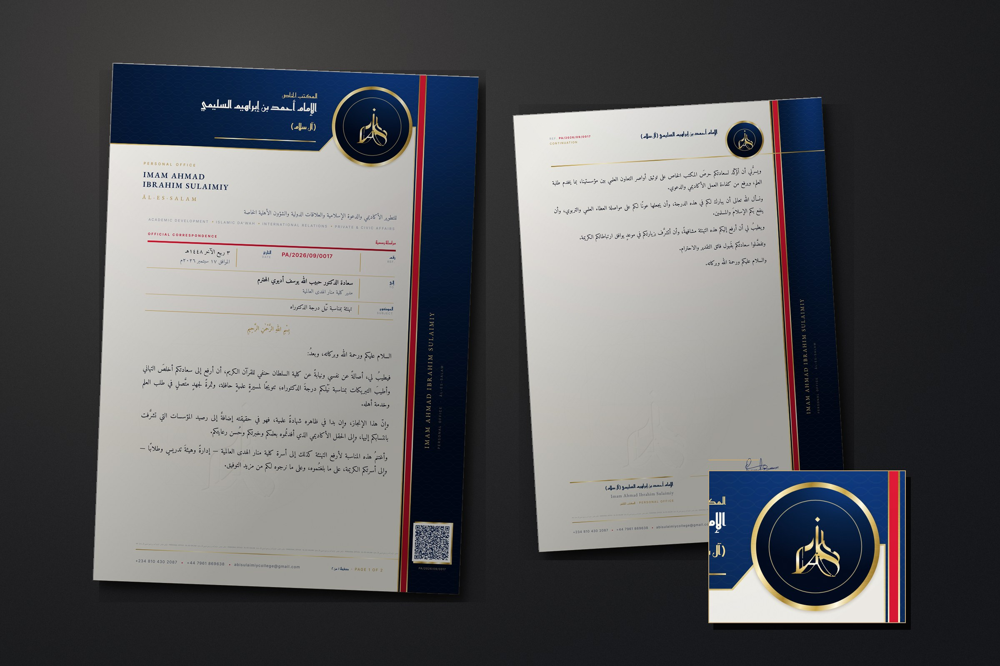

# المكتب الخاص — The Atelier Sheet

**الإمام أحمد بن إبراهيم السليمي (آل سلام)**
PERSONAL OFFICE · IMAM AHMAD IBRAHIM SULAIMIY · ĀL-ES-SALAM

**SAPPHIRE · RED · PEARL · GOLD** — and the eye should register four, not three.



> Earlier letterheads in `docs/letterhead/`, `docs/letterhead-flagship/` and
> `docs/letterhead-instrument/` are untouched.

---

## The two corrections, answered first

**1 · The insignia is never trimmed.** The previous sheet slid the mark inside a
sapphire column, which then cropped it. The fix is not to shrink the mark — it
is to make the architecture serve it. A **gold-ringed sapphire medallion**, 46mm
across, now sits on the plate's stepped lower edge and *resolves its inner
corner*. The mark is centred inside it at 19mm with **7mm of clear space on
every side** and a second hairline ring inside the first. Everything on the page
is laid out around that circle: the Arabic lockup stops 9mm short of it, the
continuation name stops 5mm short of it. When the mark and the layout conflict,
**the layout moves** — that rule is written into the stylesheet where the
measurements are.

**2 · The gold is back, and it is fresh.** The last gold was a champagne so
restrained it read as warm grey. This ramp is **eleven stops with real white in
it** (`#FFFCE9`, `#FDF4CE`) — struck foil turns the light several times across a
single letter, and its brightest turn is nearly white; three-stop "gold" is just
a yellow gradient. It is placed like jewellery, not spread:

> the medallion's double ring · the insignia itself · the keyline that follows
> the whole plate silhouette · the rule under the name · the two hairlines
> flanking the red inlay · the register hairlines · the QR frame · the signature
> rule · the foot rule

The mark is restruck in the **same ramp** as the page, so the insignia and the
rules are one metal rather than two golds that nearly match.

---

## The architecture

**One cut plate, not a band plus a sidebar.** A single sapphire shape wraps the
head and the binding edge — the **right** edge, because Arabic decides the
binding. Its lower edge **steps**: 46mm deep on the left where the Arabic lockup
lives, 30mm shallow on the right where the medallion hangs off it, chamfered
between. A plate with a silhouette reads as architecture; a rectangle reads as a
banner. The gold keyline is struck from a second plate one notch larger, so it
turns the chamfer with the shape.

**The red is an inlay, not a banner.** A 3mm spine runs the full height *inside*
the sapphire, one millimetre from its inner edge, flanked by a gold hairline on
each side. It strikes twice more and stops: the rule that opens the register,
and the reference number. Three strikes, never a wash.

**Sapphire is layered, not flat** — a radial flood from `#11418F` to `#020B1E`
with the cotton texture in overlay, because printed ink on cotton is never even,
and that unevenness is most of why it reads as ink.

---

## Typography — chosen on merit, not inherited

| Face | Role |
|---|---|
| **Amiri** | Arabic text — the body, the register values, the addresses |
| **Reem Kufi** | Arabic display — the name, the office line, the register labels |
| **EB Garamond** | Latin display *and* body |
| **Inter** | the instrument layer only — references, serials, microtext |

**The body face is the decision this page rests on.** A letterhead with an
extraordinary masthead and ordinary text is not expensive — and the previous
body was set in a competent but plain UI Naskh. **Amiri** is a revival of the
Naskh cut by the Bulaq Press in Cairo: genuine stroke modulation, properly
resolved connected forms, drawn for **book** setting, which is what a formal
letter actually is. It is set at **11.2pt on a 138mm measure, leaded 1.95** —
book proportions, not form proportions.

**Reem Kufi is by the same designer as Amiri**, so the display/text pairing is a
designed relationship rather than an assembled one. **EB Garamond** is the
European counterpart to what Amiri is — a humanist book face with calligraphic
roots — so the Latin identity and the Latin body speak in one voice. Inter is
deliberately impersonal: that part of the page is machinery, not voice.

---

## Correspondence control

A ruled register in gold hairlines, **no boxes**, opened by the red rule.
Labels are bilingual — Arabic over a 4.4pt Latin gloss:

| رقم · REF. | التاريخ · DATE | إلى · TO | الموضوع · SUBJECT |
|---|---|---|---|

`من · FROM` drops into the same grid when a letter needs it — one more
`.reg-row`, and nothing else shifts. The classification (`مراسلة رسمية ·
OFFICIAL CORRESPONDENCE`) sits above the register in red at 5.2pt, discreet
rather than banded across the page.

**The responsible-person line was restyled, not translated.** `SP:` and `FOR:`
were office shorthand rather than international convention, so the block now
simply identifies the person and the function, and in an Arabic letter the
**Arabic form leads**:

```
أ. عبد الله السليمي (SMPr · MMJ · Op-Ed)
للعلاقات والاتصالات الداخلية
COMMUNICATIONS & INTERNAL RELATIONS
```

set smaller than the principal's block, as a private office requires — one
office, one function, no invented divisions. An English letter takes
`Abdullah Sulaimiy (SMPr, MMJ, Op-Ed) / For: Communications & Internal
Relations`.

---

## The correspondence itself

The Arabic was rewritten for register, not merely for grammar. **Every
construction in which the writer asked leave to address the recipient is gone.**

| Before | After |
|---|---|
| `أرجو أن تتكرَّموا بالإذن لي بزيارتكم` | `ويطيبُ لي أن أتشرَّف بزيارتكم في موعدٍ يوافق ارتباطاتكم الكريمة` |
| `فإنه ليَسُرُّني ويُشرِّفني` | `فيطيبُ لي` |
| `ولذلك فإننا إذ نهنّئ` | `وأغتنمُ هذه المناسبة لأرفع التهنئة` |

A senior office does not petition for permission to congratulate a colleague.
The warmth and humility proper to Islamic scholarly correspondence are kept; the
subordination is not. The meaning and the facts are unchanged.

**One thing to verify.** The Hijri date `٣ ربيع الآخر ١٤٤٨هـ` is computed from
the *tabular* Islamic calendar and can differ by a day from a sighting
convention. Confirm it against the office's practice before issuing.

---

## Pagination

The continuation sheet keeps the **pier and the red inlay** — the binding edge
continues — and drops the head. A **26mm medallion** keeps the mark present and
complete; the name clears it by 5mm. `REF.` and `CONTINUATION` sit in the
opposite corner. The field opens at **44mm**, so a continuation sheet carries
about **200mm of set type** against the first sheet's **100mm**.

A **blank** sheet cannot know how long a letter will run, so it carries only its
own number (`صفحة ١ · PAGE 1`); the `of N` appears when a letter is set. The
specimen runs to two sheets; the same pattern takes as many as a letter needs.

---

## Security

- **QR** — real, and subordinate. Version 10, 57×57 modules, ECC Q, four-module
  quiet zone: **0.386 mm per module at the 22mm it prints**. It carries a MECARD,
  so a phone gets the office into its contacts. `tools/build-qr.py` prints the
  module size on every build and **decodes its own output at print resolution**.
- **Microtext** at 2.4pt along the foot — a grey rule to the eye, legible under
  a loupe, mush to a photocopier.
- **Latent geometry** — an octagram construction pressed into the field, found
  in raking light rather than seen.
- **Guilloché** — engine-turned line-work inside the sapphire.
- **Watermark** — the insignia, debossed, low in the field.
- **Serial** — the reference repeated at the foot of the pier.

No domain is invented anywhere.

---

## Production

Press **PRODUCTION SPEC** on `letterhead.html` (screen only, never prints).

**Substrate.** 120gsm pearl-white cotton; 300gsm for cards.

| Element | Process |
|---|---|
| The plate | **SAPPHIRE FLOOD**, offset |
| The keyline, medallion ring, rules, QR frame | **GOLD FOIL** |
| The insignia | **GOLD FOIL**, cut to the strapwork, complete |
| The inlay | **RED**, offset — clean and unmuddied |
| Guilloché, microtext, latent geometry | Fine-line, *printed* — foil cannot hold a 2.4pt letterform |
| The insignia, page centre | **WATERMARK in the stock**, else blind emboss |
| Body, register, addresses | Letterpress |

**Ink coverage ≈ 26%.** Offset or letterpress, not office digital — a toner
device will band across the plate and drop the microtext. Ask for a wet-proof on
the real stock.

**The standing constraint.** The mark is a raster image at roughly 600dpi at the
size used. **Foil and emboss dies are cut from vector**, so a die cannot be made
from this file — have it traced before ordering foil. Everything not needing a
die is final.

---

## Rebuilding

```bash
pip install fonttools brotli pillow numpy pymupdf qrcode opencv-python-headless

python3 tools/build-typography.py      python3 tools/build-textures.py
python3 tools/cutout-logo.py <src>     python3 tools/build-mark-variants.py
python3 tools/cutout-signature.py <src> <out.png>
python3 tools/build-qr.py              python3 tools/build-pages.py
python3 tools/build-presentation.py
```

All three documents are generated from one source — the only way the masthead on
correspondence cannot drift from the masthead on the blank.

### Print bugs found by rasterising the PDFs

1. **`background-clip:text` leaks** — a sliver of unclipped background prints as
   a faint metallic rule under every line. Metallic *type* is a solid with a
   micro-bevel; the eleven-stop ramp is for *blocks*.
2. **Variable fonts are not embedded** — Chrome substitutes a system serif
   silently. Every face is pinned to a static instance before subsetting.
3. **A Latin-only font stack carrying Arabic falls back silently** and embeds
   DejaVu Sans. It recurred here in the signature role line and the folio; every
   mixed-script element now carries an Arabic fallback.
4. **`rotate(-90deg)` with `transform-origin:0 0`** sends the run up and its
   depth to the *right* of the anchor, so a vertical column is placed with
   `left`, never `right`.
