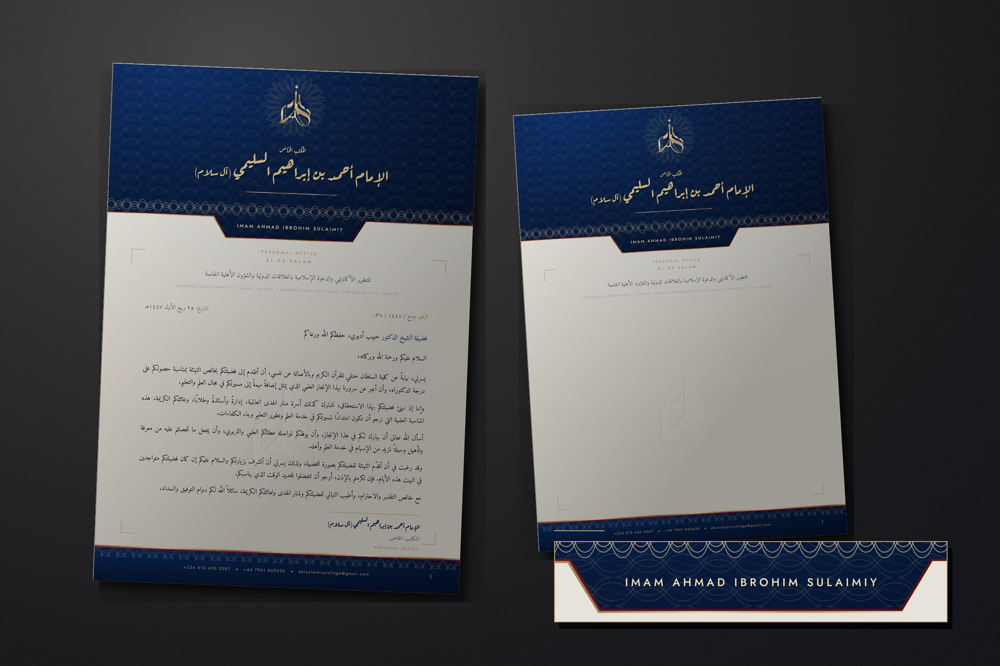

# المكتب الخاص — Flagship Letterhead

**الإمام أحمد بن إبراهيم السليمي (آل سلام)**
PERSONAL OFFICE · IMAM AHMAD IBROHIM SULAIMIY · ĀL-ES-SALAM
ACADEMIC DEVELOPMENT • ISLAMIC DA‘WAH • INTERNATIONAL RELATIONS • PRIVATE & CIVIC AFFAIRS

A flagship A4 letterhead, composed from a blank canvas. Five genuinely
different architectures were built and printed before one was chosen and pushed
much further. Sapphire, crimson, champagne foil and pearl cotton.

> This folder is separate from `docs/letterhead/`, which is untouched. Nothing
> here is a revision of that sheet.



---

## The set

| File | What it is |
|---|---|
| **`letterhead.html`** | **The flagship.** The blank first sheet. Carries a screen-only **PRODUCTION SPEC** toggle. |
| `letterhead-continuation.html` | The second sheet. |
| `letter-congratulation-dr-habib.html` | A letter set on it — specimen and working template. |
| `direction-a-future-chancery.html` | Direction A, held for comparison. |
| `direction-b-imperial-scholarly.html` | Direction B — the one that was chosen. |
| `direction-c-contemporary-heritage.html` | Direction C. |
| `direction-d-luxury-editorial.html` | Direction D. |
| `direction-e-the-register.html` | Direction E. |
| `print/*.pdf` | **Print-ready PDFs.** A4, fonts embedded. Hand these to a printer. |
| `presentation.jpg` | The set photographed, with the crown edge magnified. |
| `assets/` | The stylesheets, the typography, and the mark in each process. |
| `tools/` | Four build scripts. See **Rebuilding**. |

Print at **A4, 100% scale, margins: none, background graphics: on** — or just
print the PDFs.

---

## The five directions

**A · FUTURE CHANCERY** — the sapphire as a structural member: a 48mm pier
bleeding off three edges, the identity mounted on it vertically the way a
building carries its name, one foil rule crossing the boundary, a crimson index
bleeding off the spine at a measured height.

**B · IMPERIAL SCHOLARLY** — a crown of flood sapphire closed by engine-turned
guilloché, the name struck *out* of it in foil, a crimson ribbon descending onto
the sheet, the foot answering the head.

**C · CONTEMPORARY HERITAGE** — a gallery wall. The sapphire appears once as a
small plaque holding the mark; everything else is hairlines on open paper, with
a girih lattice pressed blind into the lower field and a single crimson square
on the grid intersection.

**D · LUXURY EDITORIAL** — the grammar of a masthead and a colophon. The name
set enormous and hung off the right margin; everything the office *is* filed
down the left in 6pt as marginalia; the mark signs the foot like a printer's
device.

**E · THE REGISTER** — an L of sapphire wrapping the head and the binding edge,
the page set out like a plate from a register of record: ruled cells, foil
registration crosses, a coded reference, and the mark not placed on the page but
pressed *into* it at 120mm as the ground.

### Why B

Your amendment asks for flashy, royal, jewel-toned and sapphire-dominant. Only
B actually delivers that register — A and E are more original but considerably
quieter, C is the calmest thing here, and D is the least royal of the five.
Beyond matching the brief, engine-turned guilloché is the oldest genuine grammar
of authority in print: it is what is struck on an engraved certificate, a share
warrant and a banknote, and it cannot be faked in a word processor. It also
gives the clearest hierarchy — **WHO → OFFICE → PURPOSE → CORRESPONDENCE**.

A and E are kept in the folder because both are strong enough to be built out if
you would rather the office spoke more quietly.

---

## How B was pushed

The concept was a band at the top and a band at the bottom. The flagship is not.

- **The crown has a silhouette.** It is no longer a rectangle of colour but a
  shaped plate: the sapphire descends at the centre into a cartouche — and the
  cartouche exists *for a reason*, it is what holds the Latin name. The
  architecture is load-bearing, not decorative.
- **The edge is a tricolour.** Champagne, then a crimson hairline, then
  sapphire, struck in that order along the entire silhouette. Three plates in
  register is the most expensive thing on the sheet and the most diplomatic.
  Magnified in `presentation.jpg`.
- **The guilloché runs in three registers.** A faint rosette ground across the
  plate; a radial engine-turned medallion the mark is struck over, traced from a
  rose curve at 44 phases the way a geometric lathe actually cuts one; and a
  dense band closing the foot.
- **The name is struck in foil and echoed in blind emboss, in register** — the
  pairing a stationer charges most for, and the one a recipient feels before
  reading.
- **The foot answers the head** in the same three plates, inverted.
- **The crown was then cut back by 7mm.** A masthead eating a third of the sheet
  is a poster. The writing field runs 136–271mm.

---

## Identity

### The mark

Your insignia is used as given, but never as a picture. A foil die and an emboss
die cut a **silhouette** — they cannot reproduce the navy inlay or the
modelling — so the mark is separated into its gold strapwork and its inlay, and
each process is rendered from that:

| | What it is |
|---|---|
| `insignia-foil.png` | Champagne hot foil, cut to the **strapwork only**. The inlay is left unfoiled, so on sapphire it reads as sapphire and on the sheet as paper — which is exactly what a single-colour foil on a coloured ground does. |
| `insignia-emboss.png` | Blind emboss, sculpted: the strapwork stands above the inlay. |
| `insignia-deboss.png` | The same die, inverted, for the watermark. |

Light is fixed top-left across the whole set, so the relief and the type
treatments stay physically consistent.

### Colour

| | Hex | Where |
|---|---|---|
| Sapphire | `#04112B` → `#123F8E` | the crown, the plinth — the architecture itself |
| Royal blue | `#002FAB` | held in reserve; a luminous accent, never a field |
| Crimson | `#4E0C18` → `#A8213A` | the hairline in the edge, the ribbon, the index |
| Champagne gold | `#6B5430` → `#FAF2DE` | foil: eleven stops, because real foil turns the light several times across one letter |
| Pearl / paper | `#F9F6EF` → `#F2EDE1` | the writing field |
| Ink | `#151A27` | a sapphire-black. Never a neutral grey |

Crimson is **rationed**. It appears as a hairline, a ribbon and a tab — never as
a field. Red at scale stops reading as regal and starts reading as loud.

### Typography

| Face | Role |
|---|---|
| **Aref Ruqaa** | Arabic display — the name, cut as an inscription |
| **Amiri** | Arabic text — everything that must simply be read |
| **Bodoni Moda** | Latin display — the international editorial register |
| **Jost** | Latin micro — labels, register, contact, microtypography |

**One judgement you should make yourself.** The name is set in **Aref Ruqaa**,
which is derived from *Ruq‘ah*. It is beautiful, unmistakably hand-cut, and the
most distinguished-looking Arabic on the page. But Ruq‘ah is historically the
everyday hand, where **Naskh** carries scholarly formality — and this is a
senior scholar's name. An Arabic-literate recipient may read the choice as
striking, or as slightly informal. I have led with Aref Ruqaa because you asked
to be surprised, and made it a **one-line switch**:

```css
/* assets/materials.css */
--name-face:"Aref Ruqaa";   /* → "Amiri" for Naskh */
```

That single value changes every sheet in the set. Print both before deciding.

---

## Production specification

Open `letterhead.html` and press **PRODUCTION SPEC** (screen only, never prints).

**Substrate.** 120gsm pearl-white cotton for correspondence, 300gsm for cards.
A mould-made or lightly laid stock suits it — the design carries a faint cotton
fibre the real sheet will simply take over.

| Element | Process |
|---|---|
| The crown and plinth edge | **PLATE 1 · CHAMPAGNE FOIL**, then **PLATE 2 · CRIMSON**, then **PLATE 3 · SAPPHIRE FLOOD** — struck in that order, in register |
| The insignia, masthead | **GOLD FOIL**, cut to the strapwork (die 1) |
| The Arabic name | **GOLD FOIL** with a **BLIND EMBOSS** struck under it in register |
| Guilloché ground, medallion, band | Fine-line sapphire, printed with the flood — *not* foil |
| Latin name, in the cartouche | **GOLD FOIL** (die 2) |
| Rules, brackets, hairlines | **GOLD FOIL** |
| The insignia, page centre | **WATERMARK in the stock**; otherwise a second blind emboss |
| English small caps, contact | Letterpress |

**Ink coverage.** This sheet is roughly 38% flood colour. That means **offset or
letterpress**, not office digital — a toner device will band across the crown
and will not hold the guilloché hairlines. Ask for a wet-proof on the actual
stock before the run.

**One honest constraint.** The mark as supplied is a **raster image**. It prints
beautifully — about 600dpi at the size used — but **foil and emboss dies are cut
from vector artwork**, so a die cannot be made from this file. Have it traced
before ordering foil or emboss. Everything that does not need a die — offset,
digital, PDF, email — is final as it stands.

---

## Writing a letter on it

Copy `letter-congratulation-dr-habib.html`, keep the structure, replace the
field:

```html
<div class="field">
  <div class="refline"> الرقم … / التاريخ … </div>
  <p class="addressee"> … </p>
  <div class="letter"><p class="salaam">…</p><p>…</p></div>
  <div class="signature"> … </div>
</div>
```

The field is bounded at **136mm / 26mm**, measured against the printed sheet:
the masthead clears at 130mm and the plinth begins at 276.6mm. A body longer
than about **130mm of set type** belongs on `letterhead-continuation.html`.

---

## Rebuilding

```bash
pip install fonttools brotli pillow numpy pymupdf

python3 tools/build-typography.py     # → assets/letterhead-typography.css
python3 tools/build-textures.py       # → the cotton and foil-grain tiles
python3 tools/cutout-logo.py <src>    # → the mark, cut off its background
python3 tools/build-mark-variants.py  # → the mark in foil, emboss and deboss
python3 tools/build-presentation.py   # → presentation.jpg, from the print PDFs
```

### Two Chrome print bugs worth knowing about

Both were found by rasterising the PDFs and looking, not by trusting the screen.

1. **`background-clip:text` leaks.** A metallic ramp clipped to glyphs looks
   perfect on screen, but print-to-PDF paints a one-pixel sliver of the
   unclipped background along the element box — which comes out as a faint gold
   rule across the page under every foiled line. It is not the grain layer, and
   `clip-path` turns the sliver into a full rectangle. So foiled **type** is a
   solid champagne with a micro-bevel, and the eleven-stop ramp is kept for
   **blocks**, where the element itself is the shape being foiled.
2. **Variable fonts are not embedded.** Chrome silently substitutes a system
   serif, so a PDF that looked right on screen reaches the printer in Liberation
   Serif. Every face is therefore pinned to a static instance before subsetting.

A third, smaller one: an `<svg>` with no width/height attribute takes its
300×150 default, and in a `dir="rtl"` document that box aligns **right** — so a
full-width pattern band paints across only the last third of the page.
