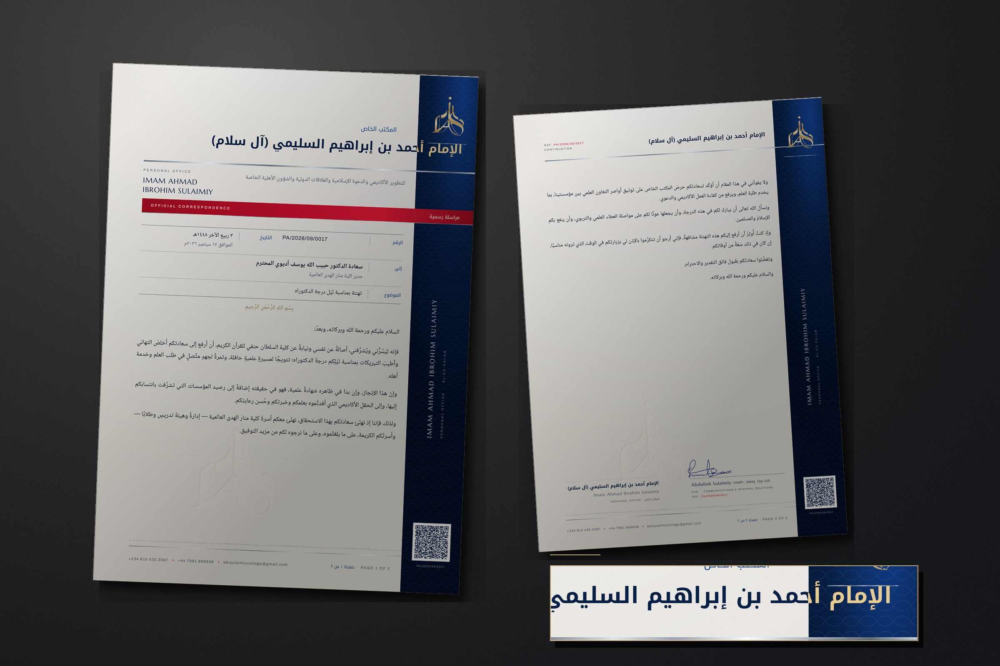

# المكتب الخاص — Direction F · THE INSTRUMENT

**الإمام أحمد بن إبراهيم السليمي (آل سلام)**
PERSONAL OFFICE · IMAM AHMAD IBROHIM SULAIMIY · ĀL-ES-SALAM
ACADEMIC DEVELOPMENT • ISLAMIC DA‘WAH • INTERNATIONAL RELATIONS • PRIVATE & CIVIC AFFAIRS

A sixth composition, built from nothing. Not a refinement of any earlier
direction. **Sapphire, red, pearl, platinum and gold.**



> `docs/letterhead/` and `docs/letterhead-flagship/` are untouched.

---

## What makes it an instrument rather than a decorated page

**The drama is structural and runs the full height.** A pier of flood sapphire
holds the binding edge — the **right** edge, because Arabic decides the binding,
not Latin filing convention. It bleeds off three sides and carries the insignia,
the Latin identity set vertically, and the verification block. It is a member of
the building, not a border on a page.

**The name crosses it.** The name is right-aligned to a point *inside* the pier
and clipped against its edge, so its first letters stand in **gold on sapphire**
and the rest in **sapphire on pearl** — one line of type, two materials, because
it spans two fields. Nothing else on the sheet does this, which is why the name
reads as the principal statement without being the largest thing on the page.
Magnified in `presentation.jpg`.

**Red is rationed.** It strikes three times — the classification bar that cuts
the full width and bleeds off the pier, the folio separator, and the reference
number in the signature block. Never as a wash. Red at scale stops reading as
regal and starts reading as loud.

**The metal is mixed, with a rule.** **Platinum** carries the architecture —
rules, the register, microtext, guilloché, the whole instrument layer. **Gold**
is held back for two things only: the insignia, and the principal's name.
Warmth appears exactly where authority does. Most luxury stationery picks one
metal; using two with a rule about which goes where is what stops the page
reading as merely gilded.

---

## The set

| File | What it is |
|---|---|
| **`letterhead.html`** | The blank first sheet. Screen-only **PRODUCTION SPEC** toggle. |
| `letterhead-continuation.html` | A blank continuation sheet. |
| `letter-tahniah-dr-adewuyi.html` | A **two-sheet letter** set on it — specimen and template. |
| `print/*.pdf` | Print-ready. A4, fonts embedded. |
| `presentation.jpg` | The set photographed, with the name-crossing magnified. |
| `assets/`, `tools/` | Stylesheets, typography, the mark in each process, six build scripts. |

---

## The correspondence register

The sheet expects to be corresponded **on**, not written around. Beneath the
classification bar sits a ruled register — **platinum hairlines, no boxes
anywhere**:

| | |
|---|---|
| **الرقم** | the reference, `PA/2026/09/0017` |
| **التاريخ** | Hijri, with `الموافق` and the Gregorian beneath |
| **إلى** | recipient, with the official position set smaller under the name |
| **الموضوع** | subject |

`من` is available in the same grammar when a letter needs it — add one more
`.reg-row`. The blank sheet prints the labels and the rules; a letter fills the
values. Adding a field never disturbs the others, because the rows are a grid,
not a drawn box.

---

## Typography — entirely new

Nothing from the earlier letterheads was carried over.

| Face | Role |
|---|---|
| **Noto Kufi Arabic** | the name, the office line, the register labels |
| **Noto Naskh Arabic** | letter bodies, addresses, anything read at length |
| **Marcellus** | Latin display — Roman inscriptional capital |
| **Archivo** | the instrument layer — references, serials, microtext |

The pairing is not a contrast, it is a rhyme: **Kufic and Roman capitals are
both carved letterforms**, cut into stone rather than written with a pen.
Archivo is deliberately the odd one — a technical grotesque for the parts of the
page that are machinery rather than voice.

This also settles the question raised by the last letterhead. Kufic is the
monumental hand — the script of inscriptions, coinage and the carved dedication
over a doorway. It is neither an everyday hand like Ruq‘ah nor conventional
book Naskh, so the objection to setting a scholar's name in Ruq‘ah does not
arise. `--name-face` in `materials.css` still switches it in one line.

---

## The security layer

Not decoration. Each element is something a security printer would actually
supply:

- **Microtext** at 2.4pt along the foot — reads as a grey rule, resolves under a
  loupe. Photocopies as mush, which is the point.
- **Latent geometry** — an octagram construction pressed faintly into the
  writing field, found in raking light rather than seen.
- **Guilloché** — fine engine-turned line-work in the pier.
- **Watermark** — the insignia, debossed, low in the field.
- **Serial** — the reference repeated at the foot of the pier.
- **QR** — genuinely scannable. **Version 10, 57×57 modules, ECC Q, four-module
  quiet zone: 0.386 mm per module at the 22 mm it prints.** It carries a MECARD,
  so a phone gets the office straight into its contacts. A full vCard pushed it
  to version 21 — 0.18 mm per module, unreadable off paper — which is why the
  payload is compact. `tools/build-qr.py` prints the module size on every build
  and **decodes its own output at print resolution** to prove it.

No domain is invented anywhere. If the office stands up a verification
endpoint, change `PAYLOAD` to the URL and rebuild; the geometry already suits it.

---

## Signature architecture — two hands

A letter from a private office is *issued* by somebody as well as *signed* by
somebody, so the foot carries both:

- **Right — the principal.** 15mm of clear space for a wet signature, a platinum
  rule, then the name in Arabic and Latin and the office.
- **Left — the issuing office.** Abdullah Sulaimiy's signature, cut to
  transparency from the supplied file, then
  `Abdullah Sulaimiy (SMPr, MMJ, Op-Ed)` / `FOR · COMMUNICATIONS & INTERNAL
  RELATIONS` / `REF. PA/2026/09/0017`.

The signature was matted on **blueness, not darkness** — a darkness threshold
eats the fast thin strokes at the ends of a signature, which are exactly what
makes it look handwritten. `assets/signature-alt.png` is the second file you
sent, cut the same way.

---

## Pagination — built for two to five sheets

The continuation sheet keeps **the pier**, because the binding edge continues.
Everything else is cut back to the mark, the name at text size, one platinum
rule, and the reference in the top corner marked `CONTINUATION`. The folio runs
in both scripts — `صفحة ٢ من ٢ · PAGE 2 OF 2`.

A **blank** sheet cannot know how long a letter will run, so it carries only its
own number (`صفحة ١ · PAGE 1`); the `of N` appears when a letter is set. The
specimen letter runs to two sheets; the same `build_letter()` pattern takes as
many continuation sheets as a letter needs.

Field capacity, measured against the printed sheet: **about 108mm of set type on
sheet one** (the register takes the rest) and **about 196mm on each continuation
sheet**.

---

## The correspondence itself

The sample letter was rewritten, not pasted. It now uses the formulas a private
office actually writes with — `وبعدُ:` to open the body, `سعادة … المحترم` for a
senior academic, `وتفضَّلوا … بقَبول فائق التقدير` to close — with the register
pitched to correspondence between a scholar's office and an institution's head.
The meaning and the facts are unchanged; the courtesy, the transitions and the
grammatical precision are raised. Dignified, not ornate.

**One thing to check.** The Hijri date `٣ ربيع الآخر ١٤٤٨هـ` is computed from
the *tabular* Islamic calendar and can differ by a day from a local sighting
convention. Confirm it against the convention the office follows before issuing.

---

## Production specification

Press **PRODUCTION SPEC** on `letterhead.html` (screen only, never prints).

**Substrate.** 120gsm pearl-white cotton; 300gsm for cards.

| Element | Process |
|---|---|
| The pier | **SAPPHIRE FLOOD**, offset |
| The classification bar | **RED**, offset — a clean, unmuddied red, near PMS 186 |
| The insignia | **GOLD FOIL**, cut to the strapwork |
| The name | **GOLD FOIL** over the pier, **SAPPHIRE** on the sheet — one artwork, two plates, and the register between them is the whole trick |
| Rules, register, brackets | **PLATINUM FOIL** |
| Microtext, guilloché, latent geometry | Fine-line platinum — *printed*, not foiled; foil cannot hold a 2.4pt letterform |
| The insignia, page centre | **WATERMARK in the stock**, else blind emboss |
| Body, addresses, register values | Letterpress |

**Ink coverage is about 22%** — lower than the previous flagship because the
sapphire is a pier rather than a panel, but still **offset or letterpress, not
office digital**. A toner device will band down the pier and will not hold the
microtext. Ask for a wet-proof on the actual stock.

**The standing constraint.** The mark is a raster image. It prints at about
600dpi at the size used, but **foil and emboss dies are cut from vector**, so a
die cannot be made from this file. Have it traced before ordering foil. Anything
not needing a die — offset, digital, PDF, email — is final.

---

## Rebuilding

```bash
pip install fonttools brotli pillow numpy pymupdf qrcode opencv-python-headless

python3 tools/build-typography.py       # the four faces, subset and embedded
python3 tools/build-textures.py         # cotton and metal-grain tiles
python3 tools/cutout-logo.py <src>      # the mark, off its background
python3 tools/build-mark-variants.py    # the mark in foil, emboss, deboss
python3 tools/cutout-signature.py <src> <out.png>
python3 tools/build-qr.py               # + verifies its own decode
python3 tools/build-pages.py            # assembles all three documents
python3 tools/build-presentation.py     # presentation.jpg, from the print PDFs
```

The three documents are **generated from one source**. It is the only way the
masthead on correspondence cannot drift from the masthead on the blank.

### Print bugs worth knowing about

Found by rasterising the PDFs and looking, not by trusting the screen.

1. **`background-clip:text` leaks in print-to-PDF** — a sliver of unclipped
   background prints as a faint metallic rule across the page under every line.
   So metallic *type* is a solid with a micro-bevel; the eleven-stop ramp is
   kept for *blocks*.
2. **Variable fonts are not embedded** — Chrome silently substitutes a system
   serif. Every face is pinned to a static instance before subsetting.
3. **A Latin font stack containing Arabic falls back silently** — the microtext
   strip and the principal's role line both mix scripts, and embedded DejaVu
   Sans into the PDF until an Arabic face was added to those two stacks.
4. **`rotate(-90deg)` with `transform-origin:0 0` sends the run up and its depth
   to the *right* of the anchor** — so a vertical column is placed with `left`,
   never `right`. Placed by `right` it lands mid-page.
